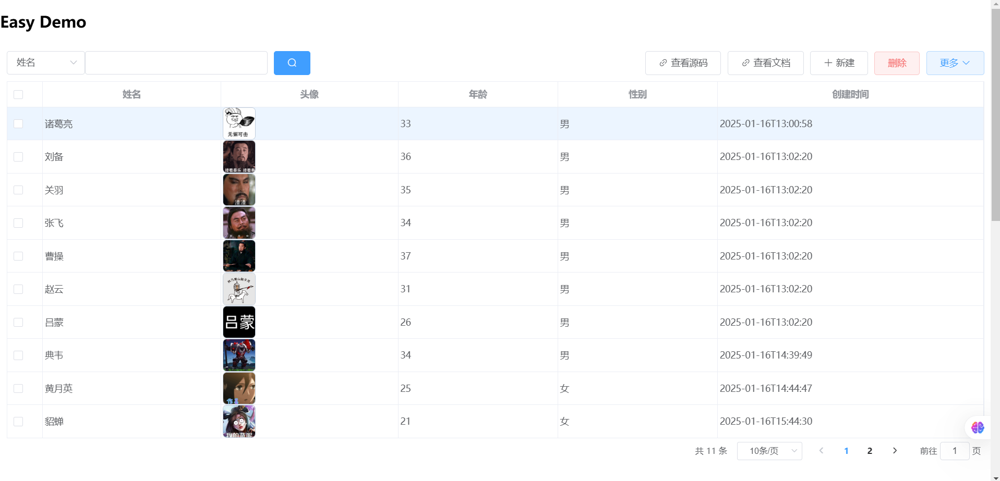
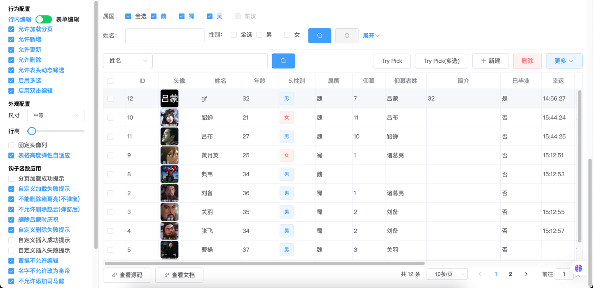

# Fast-Crud

注意：本项目只是fast-crud的demo演示项目，仅供项目集成参考。

## 介绍

- 文档参考[这里](http://pengxg.cc/tags/fast-crud)
- 在线DEMO参考[这里](http://fastcrud.pengxg.cc/)

## 展示

前端仅使用如下代码:

```vue

<template>
  <fast-table :option="tableOption">
    <fast-table-column-input prop="name" label="姓名"/>
    <fast-table-column-img prop="avatarUrl" label="头像"/>
    <fast-table-column-number prop="age" label="年龄"/>
    <fast-table-column-select prop="sex" label="性别"
                              :options="[{label: '男', value: '1'}, {label: '女', value: '0'}]"/>
    <fast-table-column-date-picker prop="createTime" label="创建时间" type="datetime" :editable="false"/>
  </fast-table>
</template>

<script>
  import {FastTableOption} from "../../../packages";

  export default {
    name: "EasyDemo",
    data() {
      return {
        tableOption: new FastTableOption({
          module: 'student',
        })
      }
    },
    methods: {
      expandButton({choseRow, checkedRows, editRows}, type) {
        if (type === 'code') {
          window.open('https://github.com/pengxianggui/fast-crud-demo/blob/main/web-ui/src/example/easy/EasyDemo.vue', '_blank')
        } else if (type === 'doc') {
          window.open('http://pengxg.cc/tags/fast-crud', '_blank')
        }
      }
    }
  }
</script>
```

就可以实现一个完整CRUD功能的表格，且具备强大搜索过滤功能和批量编辑功能、以及扩展性：


更完整的demo(包括如何扩展):


## 使用方式

### 后端集成

#### 引入maven依赖

```xml

<dependencies>
    <dependency>
        <groupId>io.github.pengxianggui</groupId>
        <artifactId>fast-crud-spring-boot-starter</artifactId>
        <version>${version}</version>
    </dependency>
    <!-- 下面这个可选 -->
    <dependency>
        <groupId>io.github.pengxianggui</groupId>
        <artifactId>fast-crud-auto-generator</artifactId>
        <version>${version}</version>
    </dependency>
</dependencies>
```

#### 代码生成准备(可选)

手撸一个main方法

```java
public class CodeGenerator {
    public static void main(String[] args) {
        CodeAutoGenerator.builder()
                .author("pengxg") // 替换为你的名称
                .module("demo") // maven多模块时配置模块名,表名要生成的代码文件存放的模块
                .url("jdbc:mysql://127.0.0.1:3306/fast-crud") // 替换成你的数据库连接地址
                .username("root") // 替换成你的数据库用户名
                .password("123456") // 替换成你的数据库密码
                .parentPkg("io.github.pengxianggui.crud.demo") // 替换成你的包根目录
                .build()
                .generate();
    }
}
```

> 运行这个main方法，会交互式询问要针对哪个表生成代码文件，可选择性生成对应的controller、service、serviceImpl、mapper以及mapper.xml。
> 且生成的controller方法已具备crud相关接口

### 前端引入

详见[这里](web-ui/README.md)

## Roadmap

### 1.x 版本

#### 后端: 基础功能CRUD接口

- [X]  支持基于注解动态生成CRUD涉及的相关接口(新增(批量新增)、删除(批量删除)、修改(批量修改)、查询(分页、列表、详情)
  、唯一性验证)
- [X]  支持controller、service、serviceImpl、mapper、entity自动生成
- [X]  调整CRUD动态注册策略: 不根据ApiOperation来识别是否是接口方法，而是通过GetMapper、PostMapper、DeleteMapper、PutMapper、RequestMapper等来识别
- [X]  移除对knife4j-spring-boot-starter的强依赖

#### 前端: 提供配套的前端CRUD表格组件库

##### 创建(C)

- [X]  提供新增按钮功能, 支持
- [X]  行内新增(必填校验)
- [X]  弹窗表单新增(表单校验)
- [X]  批量新增

##### 查询(R)

- [X]  **快筛**：表单形式的筛选，特点：快速。基于表格列定义 quicker-filter 自动生成, 并支持自定义开发
- [X]  **简筛**：单一输入框的简单筛选，特点：简单。基于表格列定义 filter 自动生成的简单筛选，每次只能针对一个属性(
  可切换属性)。
- [X]  **动筛**：基于表头的动态筛选，特点：筛选项可动态增减。每一列的表头支持点击弹窗输入过滤，支持：
- [X]  普通字符串模糊匹配(通过=前缀的精准匹配)
- [X]  枚举类型(下拉单选/checkbox多选)的精准匹配
- [X]  日期、日期时间、时间的范围匹配
- [X]  数值类型的范围或精准匹配(可选)
- [X]  支持针对该列的distinct查询，并支持勾选以便多值精准匹配(in)
- [X]  输入的过滤条件合理美观的展示在过滤列表, 并且可二次编辑, 包括启/禁用(参考es日志搜索)

##### 更新(U)

- [X]  提供双击行编辑功能:
- [X]  行内编辑(必填校验)
- [X]  弹窗表单编辑(表单校验)
- [X]  批量编辑: 当前页所有记录均进入可编辑模式(行内)

##### 删除(D)

- [X]  删除功能: 删除单行/批量删除

##### 其它

- [X]  增加FastTableColumnFile和FastTableColumnImg，分别文件上传和图片上传功能
- [X]  FastTableColumnObject: 根据另一个tableOption和render来渲染弹窗pick对象，可以回填到当前行
- [X]  支持"更多"里扩展增加新功能按钮

### 2.x 版本：CRUD的外围扩展

- [ ]  批量修改: 选择要修改的行，弹窗输入要修改的字段和值, 批量更新这些行(输入一次值即可作用所有选中行)
- [x]  xlsx数据导出功能: 导出当前筛选条件下的当前页数据/全部数据，可勾选字段
- [ ]  **存筛**：应用已保存的筛选条件进行筛选，下拉按钮菜单，特点：针对已保存的组合筛选条件进行筛选。
- [ ]  表格自定义配置(设置列宽、冻结等用户个性化设置)
- [ ]  支持针对mapping.js进行扩展，以便自定义增加新的FastTableColumn*组件
- [ ]  ~~**高级筛选**: 支持类似jira中jql的使用方式。~~

## ChangeLog

参考[这里](http://pengxg.cc/archives/fast-crud-changelog)
